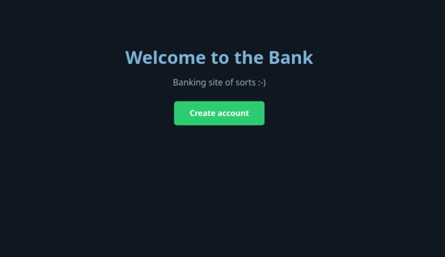
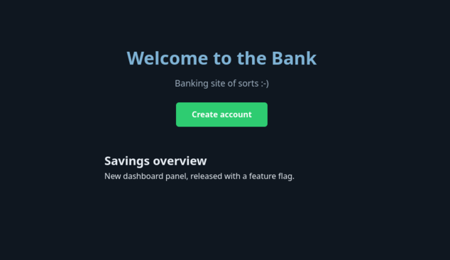

# Site URL: <http://13.63.139.190>

## Feature flag: deployment vs release (VG)

The new "Savings overview" panel on the landing page (`frontend/components/FeatureBanner.js`,
rendered in `frontend/pages/index.js`) is controlled by one flag in `.env` (see `.env.example`):

```bash
NEXT_PUBLIC_FEATURE_NEW_DASHBOARD=false   # deployed but hidden (no release)
NEXT_PUBLIC_FEATURE_NEW_DASHBOARD=true    # released, panel is visible
```

- **Deployment** = the code ships inside the Docker image but the panel stays hidden.
- **Release** = the flag is `true`, so users actually see the panel.
- `NEXT_PUBLIC_*` vars are baked into the JS bundle at `next build` time, so flipping
  the flag requires a rebuild: `docker compose up -d --build` (a plain `restart` is not enough).

### Flag OFF (`false`): deployed, not released



### Flag ON (`true`): released



## CI/CD (GitHub Actions)

`.github/workflows/deploy.yml` runs on pushes and pull requests targeting `main`:

1. **Frontend** (`working-directory: ./frontend`): `npm ci` → `npm run lint` → `npm run build`.
2. **Backend**: `npm ci --prefix backend` + `node --check backend/server.js` + Vitest unit tests (`npm test --prefix backend`).
3. **E2E**: installs Playwright Chromium, starts the isolated test stack (`docker-compose.test.yml`: web `:3002`, api `:3101`, throwaway database, test-only `JWT_SECRET` from the `JWT_SECRET_TEST` secret — never the production key), waits for health, runs `npm run test:e2e`, then tears the stack down.
4. **Deploy** (needs all checks green, push to `main` only): SSH into EC2 via secrets `HOST`, `USERNAME`, `SSH_KEY`
   (names only; values live in GitHub Settings → Secrets and variables → Actions, never in
   the repo), then `git pull` + `docker compose up -d --build` (`--build` is required so the
   new code actually ends up in the images).
5. Test-gating was verified twice: a broken expectation turned the pipeline red with `deploy`
   skipped, then the revert turned it green with `deploy` running (see the commit history).

## Inloggning med JWT i HttpOnly-cookie (VG)

Plaintext-lösenord och sexsiffriga sessionskoder är ersatta med bcrypt-hashar och
kortlivade JWT:er:

- **Registrering** (`POST /users`): lösenordet måste vara minst 8 tecken och hashas med
  `bcrypt.hash(password, 12)` innan det sparas i `users.password_hash`. Samma lösenord ger
  olika hashvärden tack vare unikt salt.
- **Inloggning** (`POST /sessions`): `bcrypt.compare` mot hashen. Vid lyckad inloggning
  signeras en JWT (`sub` = användar-id, `HS256`, `issuer: banken`, `audience: banken-api`,
  `expiresIn: 15m`) och skickas som cookien `access_token` (`httpOnly`, `sameSite: lax`,
  15 minuters livslängd). Svaret innehåller aldrig token eller hash. Samma felmeddelande
  oavsett om användarnamnet saknas eller lösenordet är fel.
- **Skyddade routes** (`POST /me/accounts`, `/me/accounts/transactions`,
  `/me/accounts/withdrawals`, `/me/transactions`, `POST /logout`) går via middleware
  `requireAuth`, som läser cookien, verifierar signaturen med `jwt.verify()` och lägger
  det kontrollerade id:t i `req.userId`. Aldrig något id från request body.
- **Frontend** skickar `credentials: "include"` i alla anrop och håller bara
  visningsnamnet i React state (`AuthContext`) — token finns aldrig i `localStorage`.
  CORS tillåter exakt frontend-origin med `credentials: true`.
- **Utloggning** (`POST /logout`) rensar cookien; token i sig förblir giltig till sin
  `exp` eftersom JWT är tillståndslös (se säkerhetsfråga 5).

### Miljövariabler (namn — aldrig värden i Git)

| Variabel | Var | Beskrivning |
|---|---|---|
| `JWT_SECRET` | `backend/.env` lokalt, root-`.env` för containern, EC2:ns `.env` | Signeringsnyckel, minst 32 byte (`openssl rand -hex 32`). Servern vägrar starta utan den. Eget värde per miljö. |
| `JWT_SECRET_TEST` | GitHub Secret + `docker-compose.test.yml` | Testnyckel som bara används av E2E-stacken i CI/lokalt. Aldrig produktionsnyckeln. |
| `FRONTEND_ORIGIN` | `.env` / compose | Exakt webbläsar-origin som får anropa API:t med cookies (portar räknas i CORS). |
| `COOKIE_SECURE` | `.env` | `true` endast över HTTPS — webbläsare nobbar Secure-cookies på vanlig HTTP. |
| `POSTGRES_*`, `DATABASE_URL`, `NEXT_PUBLIC_API_URL` | som tidigare | Oförändrat sedan tidigare uppgifter. |

### Starta lokalt

```bash
cp .env.example .env        # fyll i POSTGRES_PASSWORD + generera JWT_SECRET
cp backend/.env.example backend/.env  # samma värden för körning utan Docker
docker compose up -d --build
```

Vid schemaändringar (t.ex. `password_hash`): `docker compose down -v` återskapar
databasen tom — all data raderas, användare måste registreras på nytt.

### Grön GitHub Actions-körning

<https://github.com/numinousv/bank-db/actions/runs/37468336240> (grön körning på
`main` efter JWT-migreringen: frontend + backend + E2E + deploy).

### Säkerhetsfrågor

1. **Varför kan du läsa en JWT-payload utan signeringsnyckeln, och vad skyddar
   signaturen?** Payloaden är bara Base64url-kodad, inte krypterad — vem som helst kan
   avkoda den. Signaturen (HMAC med serverns hemliga nyckel) bevisar att innehållet inte
   har ändrats och att det var servern som utfärdade token. Servern verifierar signaturen
   innan den litar på något i payloaden.
2. **Vad händer om någon stjäl en giltig token innan den går ut? Stoppar en signatur
   den personen?** Nej — signaturen bevisar bara att token är äkta utfärdad, inte vem som
   håller i den. En stulen token går att använda fram till `exp`. Därför: kort livslängd
   (15 min), HttpOnly-cookie (oåtkomlig för stulen-via-XSS JavaScript) och utloggning som
   rensar cookien.
3. **Vad är skillnaden mellan att hasha ett lösenord och att signera en token?**
   Hashning (bcrypt, enkelriktad + salt) döljer en hemlighet för lagring — den går inte
   att räkna tillbaka. Signering (HMAC) bevisar äkthet/integritet på data som förblir
   läsbar. Olika syften: lagra hemligheter vs. bevisa äkthet.
4. **Vilken risk finns med att lagra en token i `localStorage` om sidan får en
   XSS-sårbarhet?** All JavaScript på sidan kan läsa `localStorage`, så injicerad kod kan
   stjäla token direkt. Därför ligger vår JWT i en HttpOnly-cookie som JavaScript inte
   kommer åt.
5. **Varför kan servern inte automatiskt veta att en JWT ska sluta gälla när användaren
   klickar på Logga ut?** JWT är tillståndslös — servern sparar inget om utfärdade
   tokens. Utloggning raderar bara cookien i webbläsaren; själva token är tekniskt giltig
   till sin utgångstid. Det är priset för tillståndslöshet, och skälet till kort `exp`.
6. **Vilka hemligheter finns i projektet, och var ska de lagras?** `POSTGRES_PASSWORD`
   och `JWT_SECRET` i `.env`/`backend/.env` lokalt (git-ignorerade, `chmod 600`),
   `JWT_SECRET_TEST` som GitHub Secret för CI-testerna (aldrig produktionsnyckeln),
   SSH-deployhem (GitHub Secrets `HOST`/`USERNAME`/`SSH_KEY`), och på EC2 i serverns
   `.env`. Aldrig i Git, loggar, README eller workflow-filer.

## Drift (Docker Compose + nginx)

Allt körs som containrar på en Fedora EC2-instans: `web` (Next.js), `api` (Express), `db` (PostgreSQL 18) och `nginx` som exponerar sajten på port 80 — ingen port behövs i webbläsaren.

## Database

PostgreSQL 18 i `db`-containern med bestående volymen `pgdata`. Tabellerna (`users`, `accounts`, `transactions`) skapas av `database/init.sql` vid första start (och av backendens `CREATE TABLE IF NOT EXISTS` som backup). Lösenord lagras aldrig i klartext, bara som bcrypt-hash i `users.password_hash`. Inloggningssessioner är tillståndslösa JWT i en HttpOnly-cookie — ingen `sessions`-tabell behövs. Databasanvändaren äger databasen, så inga manuella GRANT behövs. Data överlever omstarter via volymen. OBS: vid schemabyte (t.ex. inför JWT-migreringen) återskapas databasen med `docker compose down -v`, vilket raderar all data.

### Skapa en Banksajt och publicera på aws

I dagens uppgift ska vi öva på att skapa en react-sajt med backend i express och publicera den på en ec2 instans i aws.

### Data i backend

I bankens backend finns tre databastabeller i PostgreSQL: `users` för användare, `accounts` för bankkonton och `sessions` för engångslösenord. (Lokala tester kör in-memory fallback utan PostgreSQL.)

**Users**
Varje användare har ett id, ett användarnamn och ett lösenord.

```
[{id: 101, username: "Joe", password: "hemligt" }, ...]
```

**Accounts**
Varje bankkonto har ett id, ett användarid och ett saldo.

```
[{id: 1, userId: 101, amount: 200 }, ...]
```

**Sessions**
När en användare loggar in skapas ett engångslösenord. Engångslösenordet och användarid läggs i sessions arrayen.

```
[{userId: 101, token: "nwuefweufh" }, ...]
```

### Sidor på sajten

Banken har följande sidor på sin sajt:

**Landningssida**
Ska innehålla navigering med länkar till Hem, logga in och skapa användare och en hero-section med knapp till skapa användare

**Skapa användare**
Ett fält för användarnamn och ett för lösenord. Datat ska sparas i arrayen users i backend och ett bankkonto skapas i backend med 0 kr som saldo.

**Logga in**
Ett fält för användarnamn och ett för lösenord och en logga in knapp. När man klickat på knappen ska man få tillbaka sitt engångslösenord i response och skickas till kontosidan med useRouter.

**Kontosida**
Här kan man se sitt saldo och sätta in pengar på kontot. För att göra detta behöver man skicka med sitt engångslösenord till backend.

## Hur du klarar uppgiften

1. Klicka på knappen i uppgfiten för att kopiera repot till ditt github-konto
1. Klona repot till din dator med `git clone ...`

### Skapa frontend

1. Skriv `npx create-next-app frontend`.
1. Gå in i projektet: `cd frontend`.

### Skapa backend

1. Backa en nivå med `cd ..`.
1. Skapa en folder: backend och gå med `cd` in i foldern.
1. Skriv `npm init` och tryck Enter på alla frågor.
1. Lägg till `"type": "module"`i package.json
1. I scripts i package.json lägg till: `"start": "node server.js", "dev": "nodemon server.js"`
1. Installera dependencies: `npm i express cors body-parser`
1. Installera nodemon som dev dependency: `npm i -D nodemon`
1. Börja skriva kod i `server.js`

### Endpoints och arrayer

1. I backend skapa tre tomma arrayer: `users`, `accounts` och `sessions`.
1. Skapa endpoints för:

- Skapa användare (POST): "/users"
- Logga in (POST): "/sessions"
- Visa salodo (POST): "/me/accounts"
- Sätt in pengar (POST): "/me/accounts/transactions"

---

- När man loggar in ska ett engångslösenord skapas och skickas tillbaka i response.
- När man hämtar saldot ska samma engångslösenord skickas med i Post.

### Startkod för server.js i backend

```
import express from 'express';
import bodyParser from 'body-parser';
import cors from 'cors';

const app = express();
const port = process.env.PORT || 3001;

// Middleware
app.use(cors());
app.use(bodyParser.json());

// Generera engångslösenord
function generateOTP() {
    // Generera en sexsiffrig numerisk OTP
    const otp = Math.floor(100000 + Math.random() * 900000);
    return otp.toString();
}

// Din kod här. Skriv dina arrayer


// Din kod här. Skriv dina routes:

// Starta servern
app.listen(port, () => {
    console.log(`Bankens backend körs på http://localhost:${port}`);
});

```

### Exempel på fetch för POST i frontend

```
fetch('http://localhost:3001/users', {
    method: 'POST',
    headers: {
        'Content-Type': 'application/json',
    },
    body: JSON.stringify({
        username: 'Användarnamn',
        password: 'Lösenord',
    }),
})
.then(response => response.json())
.then(data => console.log(data))
.catch((error) => {
    console.error('Error:', error);
});

```

## Automatiska tester – Filstruktur för godkänt nivå

Repositoryt innehåller automatiska tester som körs med GitHub Actions. För att testerna ska kunna starta och använda din lösning måste du följa strukturen nedan. Du får organisera koden inuti mapparna som du vill.

### Projektstruktur och kommandon

```text
frontend/                 # Next.js-projekt
  package.json
  package-lock.json
backend/                  # Express-projekt
  package.json
  package-lock.json
  server.js
```

- Använd `npm` så att båda projekten innehåller en `package-lock.json`.
- `npm run dev` i `frontend` ska starta Next.js på port `3000`.
- `npm run build` i `frontend` ska bygga projektet utan fel.
- `npm start` i `backend` ska starta Express på port `3001`.
- Frontend ska anropa backend på `http://127.0.0.1:3001`.

### Sidor och formulär

Följande routes ska finnas:

- `/` – landningssida med rubrik, navigation och hero-knapp eller länk.
- `/register` – skapa användare.
- `/login` – logga in.
- `/account` – visa saldo och sätt in pengar.

Alla formulärfält ska ha en kopplad `label` så att de går att hitta med sitt namn. Använd tydliga svenska eller engelska namn, exempelvis `Användarnamn`, `Lösenord` och `Belopp`. Efter en lyckad inloggning ska användaren skickas till `/account`. Saldot ska visas med valutan `kr` eller `SEK` och uppdateras efter en insättning.

### API-format

Alla endpoints tar emot och svarar med JSON. Ett lyckat anrop ska ge en statuskod inom `200`–`299`.

```text
POST /users
Body: { "username": "Joe", "password": "hemligt" }

POST /sessions
Body: { "username": "Joe", "password": "hemligt" }
Response: { "token": "123456" }

POST /me/accounts
Body: { "token": "123456" }
Response: { "amount": 0 }

POST /me/accounts/transactions
Body: { "token": "123456", "amount": 250 }
Response: { "amount": 250 }
```

Engångslösenordet ska vara en sträng med sex siffror. En ogiltig token till `/me/accounts` ska ge status `401` eller `403`.

### Kör samma tester lokalt

Backend-enhetstester (Vitest, behöver varken webbläsare eller databas):

```bash
npm ci --prefix backend
npm test --prefix backend
```

E2E-tester (Playwright mot den isolerade teststacken — rör aldrig produktionsdatabasen):

```bash
npm ci --prefix frontend
npx playwright install chromium --with-deps  # systemberoenden kräver sudo på Linux
docker compose -f docker-compose.test.yml up -d --build
npm run test:e2e --prefix frontend
docker compose -f docker-compose.test.yml down -v
```

Teststacken använder en egen testnyckel (`JWT_SECRET_TEST`, se nedan) och volymen `pgdata_test` som slängs efter körningen.

## Publicera på aws

1. Överför hela projektet till din ec2-instans med t.ex. `rsync`

1. Logga in på din instans med ssh och gå med cd dit projektet ligger.

1. Installera Node.js om det inte redan är installerat.

1. Navigera till din backend-mapp och starta din server med node server.js.

1. Navigera till din frontend-mapp i ett nytt terminalfönster. Kör följande:

```
npm install
npm run build
npm run start
```

- Testa att det funkar genom att gå till din sajt i en webbläsare.

---

### :boom: Success

Efter denna uppgift ska ni kunna skapa en fullstack sajt med api och publicera på aws.

---

### :runner: VG - uppgift

everything is run using docker compose on a Fedora EC2 instance (replacing pm2, also slopbuntu is trash): `web` (Next.js), `api` (Express), `db` (PostgreSQL 18), and `nginx`, which exposes the site on port 80.

**Start the server:**

```bash
cp .env.example .env   # fill POSTGRES_PASSWORD + public IP/Domain in NEXT_PUBLIC_API_URL
chmod 600 .env
docker compose up -d --build
```

**services:**

| Tjänst                | Port     | Status                              |
| --------------------- | -------- | ----------------------------------- |
| nginx → web (Next.js) | 80       | `docker compose ps`                 |
| Backend (Express)     | 3001     | `docker compose ps`                 |
| PostgreSQL            | internal | `docker compose exec db pg_isready` |

**typical commands:**

```bash
docker compose ps
docker compose logs
docker compose restart api
docker compose down
```

**verify database (data persists, survives restarts):**

```bash
# put money in,restart api, money should be saved/persist
docker compose restart api
```

**Passwords:** handled via a git-ignored `.env` file (see .env.example) no docker secrets directory necessary, but on a larger, more sensitive scale, then it is preferable to migrate away from .env

**link to site:** <http://13.63.139.190>
